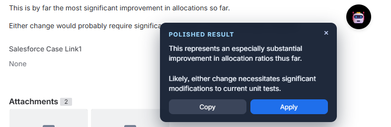

# ollama-english-polish-tampermonkey
Local AI English Polisher is a Tampermonkey userscript that grabs your current text selection, sends it to a local Ollama Qwen2.5 instance for polishing, and shows the improved version in-place. It supports draggable UI, safe selection handling, and copy/apply actions without exposing your text to the cloud.

## NOTE
- Install Ollama first: https://ollama.com
- Download a local model (example):
	- Qwen2.5 1.5B: `ollama pull qwen2.5:1.5b`
- Start the server: `ollama serve`
- Ensure the script’s `MODEL_NAME` and `API_URL` match your local setup.

## How to Use
- Install Tampermonkey (Chrome/Edge).
- In Tampermonkey, create a new script and paste the contents of `local_ai_english_polisher.user.js`, or open the file in the browser to install directly.
- Adjust `MODEL_NAME` and `SYSTEM_PROMPT` at the top of the script if needed.
- On any web page, select the text to polish and click the floating 🤖 button.
- Review the polished text in the pad, then use Copy or Apply.

## Screenshot
Place a screenshot at `mytampermonkey/assets/local_ai_english_polisher_usage1.png` and it will appear below:

